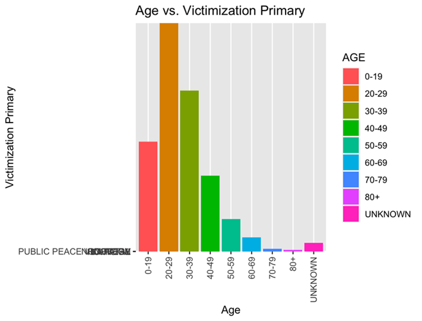
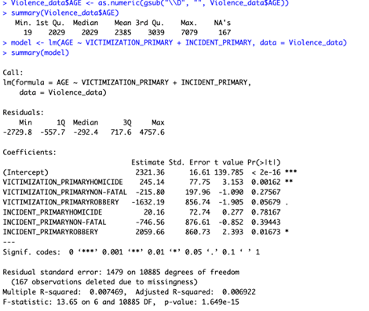
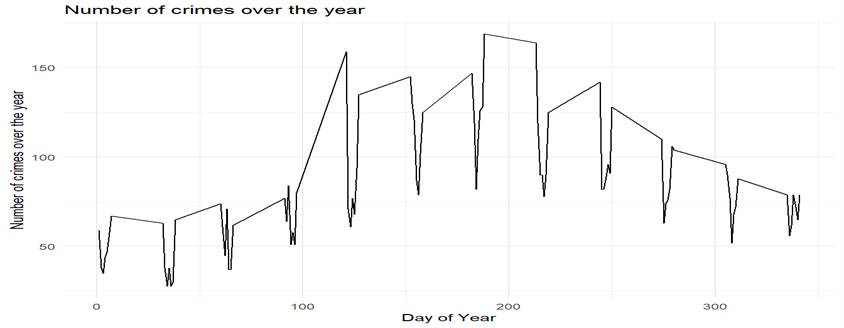
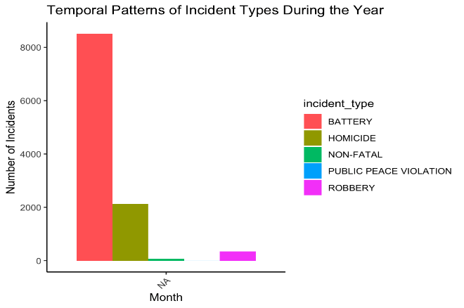
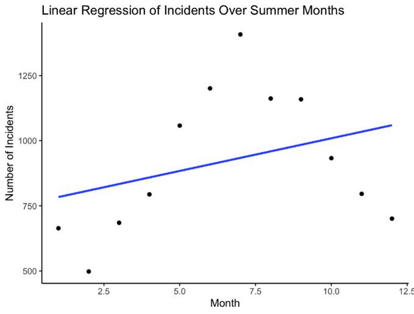
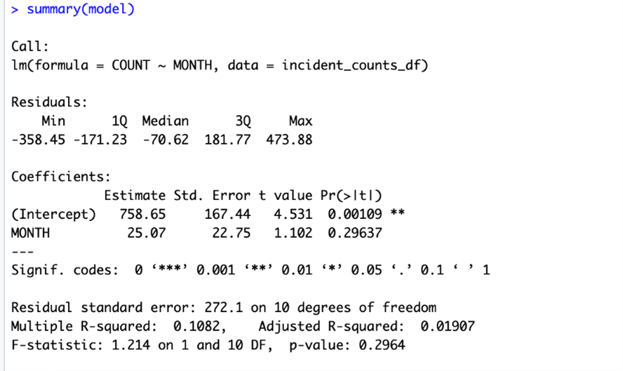
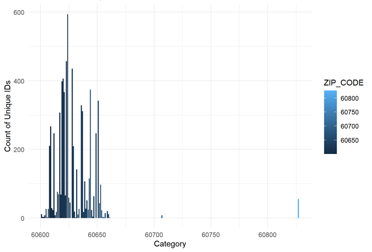
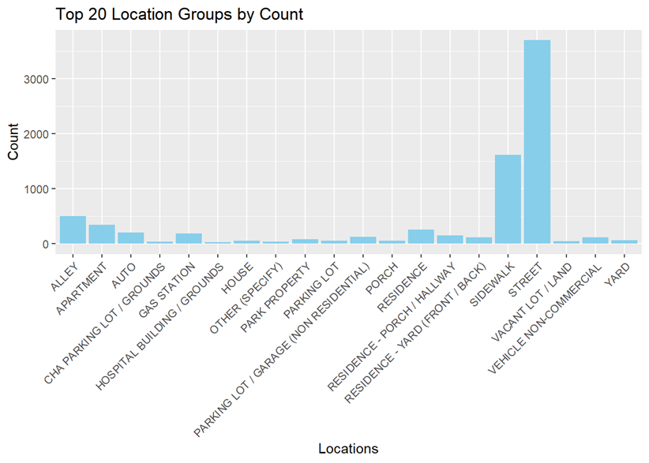
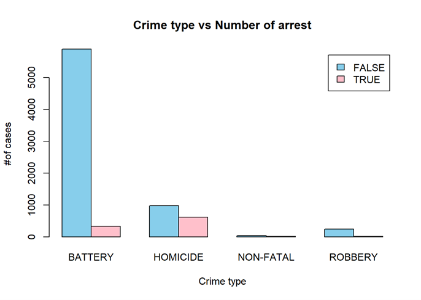

# 2021-2023 Chicago-_Crime_-Analysis

## Project Background
I love Chicago and would want to live in that city someday but with the high rise in crime rate this might in the long run affect its economic significance. Amidst the inflation in the country, residents want to feel safe in their environment but with the increasing crime activities that might be questioned as there is no promising measure to tackle this situation. The primary objective is to not only identify potential threats but also to discern patterns, foresee future increases with the aim of providing actionable insights that can inform strategic interventions and policies to enhance public safety, address vulnerabilities, and foster a resilient and secure urban environment for all residents and visitors.

** All Dataset use in this project are real and provided by leveraging the City of Chicago's Data Portal, crime data spanning from 2021 to 2023 [here](https://data.cityofchicago.org/browse?q=crime+dataset+2021&sortBy=relevance&pageSize=20&limitTo=datasets)

## Introduction

This R project analyzes crime rates in Chicago to identify key factors influencing crime patterns. The goal is to provide insights into the variables affecting crime and explore how government agencies, tourist can collaborate to mitigate risks, enhance public safety, and foster a stronger, safer community.

####  This research was presented as my Master's Degree project.

##  Problem Statement

1.	How does the age demographic contribute to crime patterns?
2.	What temporal patterns exist?
3.	Which locations consistently have the highest crime rates, and what factors contribute to their designation as hotspots?
4.	Does law enforcement presence affect crime occurrence?

## Skills/Concept Demonstrated

This analysis is a linear regression in R Studio to identify if any relationship exists. 
-  Dependent variable considered at various points is Arrest, as the frequency of reported crime in Chicago.  
-  Independent variables include demographic factor, time of the day and day of the year and other factors.
-  Visualisation
-  Predictive Analysis
  

## Analysis

###   Q1:  How does the age demographic contribute to crime patterns

Showing Age Distribution Visualisation           |             Analysis 

                     |           

### Analysis Summary

The coefficient of victimization primary homicide is 245.14 with a p-value of 0.00162. This indicates that, on average, individuals involved in homicides tend to be older compared to other victimization types, and this difference is statistically significant. The coefficient of victimization primary non-fatal is -215.80 with a p-value of 0.27567. This suggests that there is no statistically significant difference in age between non-fatal victims and other victimization types. The coefficient of victimization primary robbery is -1632.19 with a p-value of 0.05679. While the p-value is close to 0.05, indicating some evidence of a difference, the coefficient suggests that individuals involved in robberies tend to be younger, although this relationship is not statistically significant at the conventional level of significance (p < 0.05). The coefficient of incident primary homicide. is 20.16 with a p-value of 0.78167. This indicates that there is no statistically significant difference in age between incidents involving homicide and other incident types. The coefficient of incident primary non-fatal is -746.56 with a p-value of 0.39443. Like non-fatal victimization, there is no statistically significant difference in age between non-fatal incidents and other incident types. The coefficient of incident primary robbery is 2059.66 with a p-value of 0.01673. This suggests that, on average, individuals involved in robberies tend to be younger compared to other incident types, and this difference is statistically significant.

## Q2:  What temporal pattern exist

Number of Crime over the years                          | Temporal Pattern of Incident types over the years 

                 |     

The result shows that there is a pattern with an increase from day 100 to day 210. which falls between June to Early September with battery been at its highest peak. 

Showing Relationship                                    |             Analysis Result 

                           |     

###  Analysis Summary

The linear regression model indicates that there is no significant linear relationship between the month and the count of incidents. The R-squared value of 0.1082 suggests that the model explains only a small portion of the variance in the count of incidents.

## Q3:  Which locations consistently have the highest crime rates, and what factors contribute to their designation as hotspots.

How crime is distributed |  Show the most affected Zip Code that has been mostly imparted by crime   |  Top 20 Location group by count  

                 |                                 | :    

###  Analysis Summary

Image 1: This result shows that crime is uniformly distributed across chicago describing assault, homicide, robbery and others. 

Image 2 : The result from this bar chart shows that crime is largely carried out in some location that other Zip codes like 60600 - 60650 has the highest number of crime occurrence. with more occurrency between 60600-60640 where counts reach nearly 600 unique incidents.  The visualization was done using the library called ggplot in R.   This was arrived by using the variables case count and category.

## Q4: Does law enforcement presence affect crime occurrence?

Crime type and Arrest Number                             

     

## Summary 

Looking at the bar chart, its show that battery has the highest crime in chicago with a high number more than 5000 and a total number of less than 500 Arrest made could this be that at each district of the police ward there are no enough police to enforce law. 

# Other Analysis: 

## Predictive Analysis Summary: 
Crimes might slowly decrease over time in the prediction. But predictions aren't 100% perfect. I need more data to make better reasoning.

#  Recommendation and conclusion: 

1.	 Increase law enforcement presence in identified hotspots.
     Place like Austin community with the highest crime rate of 4172 and Zip code 60624 should be on red alert and also have stringent law enforcement implementation. 
2.	 Implement targeted interventions during peak crime periods.
3.   Tailor crime prevention strategies for ages 20-29.
4.   use socio-economic and demographic insight for community development and crime reduction. 

Providing actionable insights for law enforcement, policymakers, and community leaders, this research aims to enhance public safety in Chicago. Implementing recommended strategies can significantly reduce crime rates, positively impacting residents, tourists, and the community.

    

